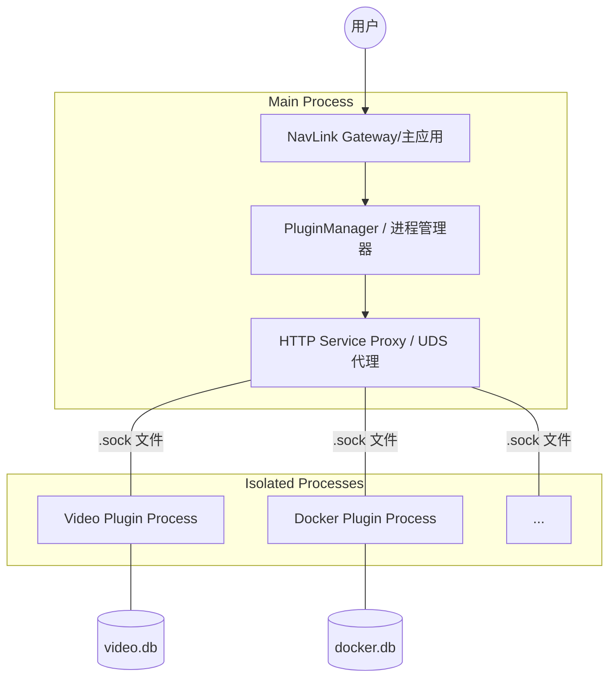

# Navlink 插件系统架构演进方案：进程隔离与 Unix Domain Socket (UDS)

## 1. 背景与现状分析

目前 Navlink 的插件系统主要采用 **“进程内挂载 (In-process Mounting)”** 模式。虽然这种模式在架构上轻量，但在实际运行（尤其是 `video` 这种大型插件）中暴露了显着的稳定性问题：

*   **原生模块冲突 (Native Module Conflicts)**：`better-sqlite3` 等 C++ 原生扩展在 Node.js 中难以被同一个进程从不同路径多次动态加载，导致插件加载失败或锁定。
*   **路由无法热更新 (Routing Ghosting)**：Express 框架不支持运行时注销路由，导致插件升级后，内存中旧路由依然拦截请求，必须重启整个容器才能生效。
*   **数据库损坏风险 (DB Corruption)**：多插件共用主进程资源，在系统异常退出（如 `kill -9`）时，SQLite 的 WAL 模式容易产生物理损坏（Malformed）。
*   **故障传播 (Fault Propagation)**：单个插件的内存溢出或逻辑死循环会直接拖垮整个主应用。

## 2. 目标架构：隔离进程模型 (Isolated Process Model)

为了解决以上痛点，建议将插件系统从“大单体”向“微内核”演进。

### 2.1 核心设计
*   **独立进程**：每个插件启动一个完全独立的子进程（Child Process）。
*   **本地通信 (UDS)**：主应用与插件之间通过 **Unix Domain Socket (UDS)** 文件进行通信，而非 TCP 端口。
*   **按需加载**：只有启用的插件才会占用系统资源。

### 2.2 逻辑架构图


## 3. 技术实施方案

### 3.1 通信机制：HTTP over UDS
主应用通过 HTTP 代理连接到插件的套接字文件。
*   **Socket 路径**：`data/plugins/{pluginId}/server.sock`
*   **优势**：无需分配和管理端口，避免端口被占用导致的启动失败；支持高并发，性能优于本机 TCP 环回。

### 3.2 进程管理器 (Process Manager)
在主应用中强化插件管理器，具备以下功能：
1.  **生命周期控制**：负责插件的 `spawn`（拉起）和 `kill`（终止）。
2.  **健康检查**：通过 `.sock` 定期发送心跳请求，如果插件无响应，自动尝试重启。
3.  **僵尸进程清理**：主应用退出时，通过信号（SIGTERM/SIGKILL）确保所有插件同步退出。
4.  **日志聚合**：将插件进程的 `stdout` 和 `stderr` 重定向到指定的日志文件或主应用控制台。

### 3.3 插件端改造
插件入口代码需从“导出 Router”改为“独立启动 Server”：
```javascript
// 插件 server.js 改造示例
const http = require('http');
const socketPath = process.env.NAV_SOCKET_PATH; // 从主应用传入

const server = http.createServer(app);
server.listen(socketPath, () => {
    console.log(`Plugin started on ${socketPath}`);
});
```

## 4. 方案对比与评估

| 维度 | 进程内模式 (当前) | 进程隔离模式 (建议) |
| :--- | :--- | :--- |
| **稳定性** | 弱（单个插件崩则全崩） | 强（物理隔离，互不影响） |
| **热更新** | 必须重启容器 | 点击按钮即刻生效，无需重启 |
| **数据库** | 容易死锁/损坏 | 独立句柄，极其稳健 |
| **内存开销** | 较低 | 较高（每个进程约有 30-50MB 固定开销） |
| **开发难度** | 简单 | 中等（涉及跨进程管理与信号处理） |
| **部署环境** | 无限制 | Linux/Docker (最高效) |

## 5. 演进路线图 (Roadmap)

1.  **第一阶段 (准备期)**：
    *   在主应用中引入 `ProcessManager` 原型。
    *   优化 `PluginManager`，使其支持 `process-based` 类型的插件识别。
2.  **第二阶段 (试点期)**：
    *   将 `video` 插件率先改造为独立进程模式。
    *   测试 UDS 通信在不同容器环境下的性能和稳定性。
3.  **第三阶段 (普及期)**：
    *   将 `sub`, `vps`, `docker` 等重型插件切换到隔离模式。
    *   对轻量级插件（如只存配置的插件）保留进程内模式以便平衡内存消耗。

## 6. 结论

通过引入 **“进程隔离 + UDS 通信”** 架构，NavLink 能够从根本上解决目前阻碍其大规模、高强度使用的稳定性短板。这不仅是技术的升级，更是从“个人工具”向“平台级软件”迈进的关键一步。
