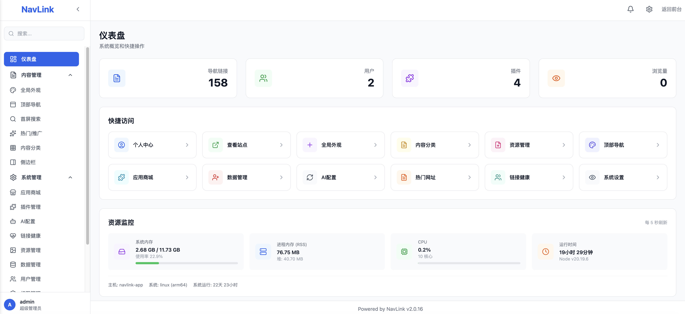
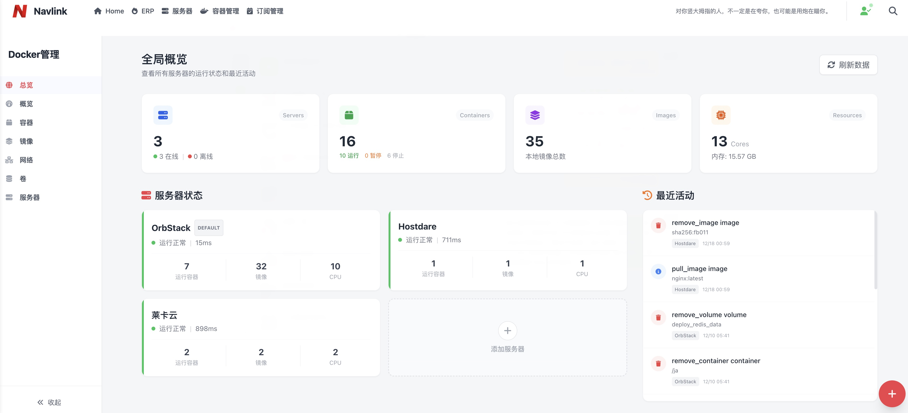
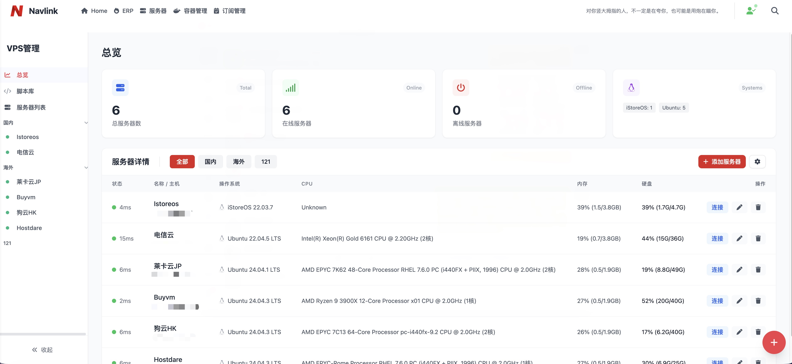
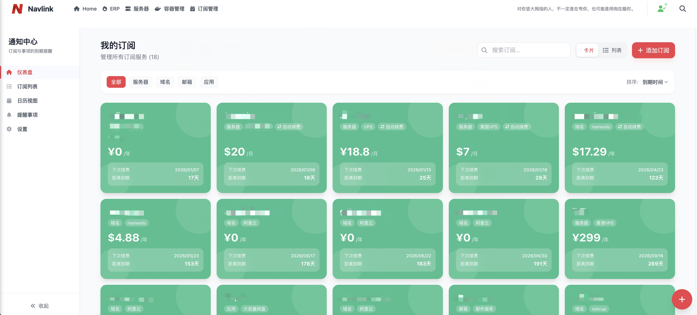
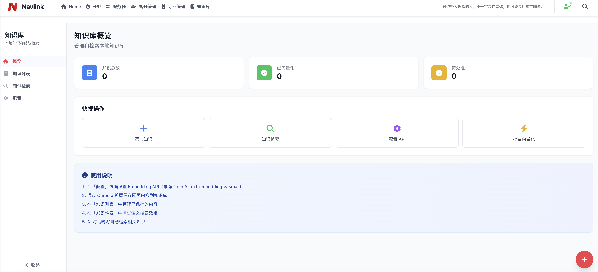

<style>
:root {
  /* 高级纯色 - 深紫色调 */
  --vp-home-hero-name-color: #1e1b4b;
  
  /* 品牌主色调 */
  --vp-c-brand-1: #6366f1;
  --vp-c-brand-2: #818cf8;
  --vp-c-brand-3: #a5b4fc;
}

.dark {
  --vp-home-hero-name-color: #e0e7ff;
}

/* Hero 标题大小调整 */
.VPHero .name {
  font-size: 48px !important;
  line-height: 1.2 !important;
}

.VPHero .text {
  font-size: 32px !important;
  color: #334155 !important;
  -webkit-text-fill-color: #334155 !important;
  line-height: 1.3 !important;
}

.VPHero .tagline {
  font-size: 18px !important;
  color: #64748b !important;
}

.dark .VPHero .text {
  color: #cbd5e1 !important;
  -webkit-text-fill-color: #cbd5e1 !important;
}

.dark .VPHero .tagline {
  color: #94a3b8 !important;
}

/* 移动端适配 */
@media (max-width: 768px) {
  .VPHero .name { font-size: 36px !important; }
  .VPHero .text { font-size: 24px !important; }
  .VPHero .tagline { font-size: 16px !important; }
}

/* 按钮高级样式 - 纯色 + 微妙阴影 */
.VPButton.brand {
  background: #6366f1 !important;
  border: none !important;
  box-shadow: 0 4px 14px rgba(99, 102, 241, 0.35);
  transition: all 0.3s ease;
}

.VPButton.brand:hover {
  background: #4f46e5 !important;
  transform: translateY(-2px);
  box-shadow: 0 8px 20px rgba(99, 102, 241, 0.4);
}

/* Feature 卡片 - 柔和浅色背景 */
.VPFeature {
  background: #fafbfc !important;
  border: 1px solid #e5e7eb !important;
  border-radius: 16px !important;
  transition: all 0.3s ease;
}

.dark .VPFeature {
  background: #1e293b !important;
  border: 1px solid #334155 !important;
}

/* 每个卡片不同的浅色背景 */
.VPFeature:nth-child(1) { background: linear-gradient(135deg, #f5f3ff 0%, #ede9fe 100%) !important; }
.VPFeature:nth-child(2) { background: linear-gradient(135deg, #fdf2f8 0%, #fce7f3 100%) !important; }
.VPFeature:nth-child(3) { background: linear-gradient(135deg, #ecfeff 0%, #cffafe 100%) !important; }
.VPFeature:nth-child(4) { background: linear-gradient(135deg, #ecfdf5 0%, #d1fae5 100%) !important; }
.VPFeature:nth-child(5) { background: linear-gradient(135deg, #fffbeb 0%, #fef3c7 100%) !important; }
.VPFeature:nth-child(6) { background: linear-gradient(135deg, #faf5ff 0%, #f3e8ff 100%) !important; }

.dark .VPFeature:nth-child(1) { background: linear-gradient(135deg, #1e1b4b 0%, #312e81 100%) !important; }
.dark .VPFeature:nth-child(2) { background: linear-gradient(135deg, #4a044e 0%, #701a75 100%) !important; }
.dark .VPFeature:nth-child(3) { background: linear-gradient(135deg, #083344 0%, #164e63 100%) !important; }
.dark .VPFeature:nth-child(4) { background: linear-gradient(135deg, #022c22 0%, #064e3b 100%) !important; }
.dark .VPFeature:nth-child(5) { background: linear-gradient(135deg, #422006 0%, #78350f 100%) !important; }
.dark .VPFeature:nth-child(6) { background: linear-gradient(135deg, #2e1065 0%, #4c1d95 100%) !important; }

.VPFeature:hover {
  transform: translateY(-6px);
  box-shadow: 0 20px 40px rgba(0, 0, 0, 0.1);
}

.dark .VPFeature:hover {
  box-shadow: 0 20px 40px rgba(0, 0, 0, 0.3);
}

/* Feature 图标 - 圆形彩色背景 */
.VPFeature .icon {
  font-size: 1.75rem;
  width: 56px;
  height: 56px;
  display: flex !important;
  align-items: center;
  justify-content: center;
  border-radius: 12px;
  margin-bottom: 12px;
}

.VPFeature:nth-child(1) .icon { background: #ddd6fe; }
.VPFeature:nth-child(2) .icon { background: #fbcfe8; }
.VPFeature:nth-child(3) .icon { background: #a5f3fc; }
.VPFeature:nth-child(4) .icon { background: #a7f3d0; }
.VPFeature:nth-child(5) .icon { background: #fde68a; }
.VPFeature:nth-child(6) .icon { background: #e9d5ff; }

.dark .VPFeature:nth-child(1) .icon { background: #4338ca; }
.dark .VPFeature:nth-child(2) .icon { background: #be185d; }
.dark .VPFeature:nth-child(3) .icon { background: #0891b2; }
.dark .VPFeature:nth-child(4) .icon { background: #059669; }
.dark .VPFeature:nth-child(5) .icon { background: #d97706; }
.dark .VPFeature:nth-child(6) .icon { background: #7c3aed; }

/* Feature 标题 */
.VPFeature .title {
  font-weight: 700;
  font-size: 1.1rem;
  color: #1e293b;
}

.dark .VPFeature .title {
  color: #f1f5f9;
}

/* Feature 描述 */
.VPFeature .details {
  color: #64748b;
  line-height: 1.6;
}

.dark .VPFeature .details {
  color: #94a3b8;
}

/* Feature 链接 */
.VPFeature .link-text {
  color: #6366f1;
  font-weight: 600;
}
</style>

## 界面预览

<div style="display: flex; gap: 24px; margin: 24px 0; flex-wrap: wrap;">
  <div style="flex: 1; min-width: 300px; text-align: center;">
    <a href="./home-screenshot.png" target="_blank">
      
    </a>
    <p style="margin-top: 12px; font-weight: 600;">🏠 首页导航</p>
  </div>
  <div style="flex: 1; min-width: 300px; text-align: center;">
    <a href="./admin-screenshot.png" target="_blank">
      
    </a>
    <p style="margin-top: 12px; font-weight: 600;">⚙️ 后台管理</p>
  </div>
</div>

## 快速体验

只需三步，即可启动您的专属导航站：

::: code-group

```bash [1. 创建目录]
mkdir navlink && cd navlink
```

```bash [2. 下载配置]
# 下载 docker-compose.yml 和 .env
curl -O https://raw.githubusercontent.com/txwebroot/Navlink-Releases/main/docker-compose.yml
curl -O https://raw.githubusercontent.com/txwebroot/Navlink-Releases/main/.env.example
mv .env.example .env
```

```bash [3. 启动服务]
docker compose up -d
# 访问 http://localhost:8000
```

:::

::: tip 💡 默认账户
用户名：`admin` / 密码：`admin123`  
请登录后立即修改密码！
:::

## 插件生态

<div style="display: grid; grid-template-columns: repeat(2, 1fr); gap: 20px; margin: 24px 0;">
  <div style="text-align: center;">
    <a href="./docker-plugin.jpg" target="_blank">
      
    </a>
    <p style="margin-top: 8px; font-weight: 600;">🐳 Docker 管理</p>
  </div>
  <div style="text-align: center;">
    <a href="./vps-plugin.jpg" target="_blank">
      
    </a>
    <p style="margin-top: 8px; font-weight: 600;">🖥️ VPS 运维</p>
  </div>
  <div style="text-align: center;">
    <a href="./sub-plugin.jpg" target="_blank">
      
    </a>
    <p style="margin-top: 8px; font-weight: 600;">📅 订阅监控</p>
  </div>
  <div style="text-align: center;">
    <a href="./kbrag-plugin.png" target="_blank">
      
    </a>
    <p style="margin-top: 8px; font-weight: 600;">📚 知识库</p>
  </div>
</div>

## 为什么选择 NavLink？

<div style="display: grid; grid-template-columns: repeat(2, 1fr); gap: 16px; margin: 24px 0;">
  <div style="padding: 20px; border-radius: 12px; background: linear-gradient(135deg, rgba(102, 126, 234, 0.1), rgba(118, 75, 162, 0.1)); border: 1px solid rgba(102, 126, 234, 0.2);">
    <h4 style="margin: 0 0 8px; display: flex; align-items: center; gap: 8px;">🚀 开箱即用</h4>
    <p style="margin: 0; color: var(--vp-c-text-2); font-size: 14px;">Docker 一键部署，无需复杂配置。预置多种搜索引擎和热门链接模板。</p>
  </div>
  <div style="padding: 20px; border-radius: 12px; background: linear-gradient(135deg, rgba(240, 147, 251, 0.1), rgba(245, 87, 108, 0.1)); border: 1px solid rgba(240, 147, 251, 0.2);">
    <h4 style="margin: 0 0 8px; display: flex; align-items: center; gap: 8px;">🎯 功能专注</h4>
    <p style="margin: 0; color: var(--vp-c-text-2); font-size: 14px;">专注于导航站核心功能，通过插件扩展更多能力，保持系统轻量高效。</p>
  </div>
  <div style="padding: 20px; border-radius: 12px; background: linear-gradient(135deg, rgba(67, 233, 123, 0.1), rgba(56, 249, 215, 0.1)); border: 1px solid rgba(67, 233, 123, 0.2);">
    <h4 style="margin: 0 0 8px; display: flex; align-items: center; gap: 8px;">🔧 灵活扩展</h4>
    <p style="margin: 0; color: var(--vp-c-text-2); font-size: 14px;">插件架构设计，按需安装功能模块。支持 Chrome 扩展，网页一键收藏。</p>
  </div>
  <div style="padding: 20px; border-radius: 12px; background: linear-gradient(135deg, rgba(79, 172, 254, 0.1), rgba(0, 242, 254, 0.1)); border: 1px solid rgba(79, 172, 254, 0.2);">
    <h4 style="margin: 0 0 8px; display: flex; align-items: center; gap: 8px;">💪 持续更新</h4>
    <p style="margin: 0; color: var(--vp-c-text-2); font-size: 14px;">活跃开发维护，定期发布新版本，持续优化用户体验。</p>
  </div>
</div>

## 社区与支持

<div style="display: flex; gap: 16px; flex-wrap: wrap; margin: 24px 0;">
  <a href="/guide/getting-started" style="flex: 1; min-width: 200px; padding: 16px 24px; border-radius: 12px; background: linear-gradient(135deg, #667eea 0%, #764ba2 100%); color: white; text-decoration: none; text-align: center; font-weight: 600; box-shadow: 0 4px 15px rgba(102, 126, 234, 0.3); transition: all 0.3s;">
    📖 使用文档
  </a>
  <a href="https://github.com/txwebroot/Navlink-Releases" style="flex: 1; min-width: 200px; padding: 16px 24px; border-radius: 12px; background: linear-gradient(135deg, #2d3748 0%, #1a202c 100%); color: white; text-decoration: none; text-align: center; font-weight: 600; box-shadow: 0 4px 15px rgba(0, 0, 0, 0.2); transition: all 0.3s;">
    📦 GitHub Releases
  </a>
  <a href="https://github.com/txwebroot/navlink-releases/pkgs/container/navlink-releases" style="flex: 1; min-width: 200px; padding: 16px 24px; border-radius: 12px; background: linear-gradient(135deg, #0ea5e9 0%, #2563eb 100%); color: white; text-decoration: none; text-align: center; font-weight: 600; box-shadow: 0 4px 15px rgba(14, 165, 233, 0.3); transition: all 0.3s;">
    🐳 Docker 镜像
  </a>
</div>

---

<div style="text-align: center; padding: 2rem 0;">

**如果 NavLink 对您有帮助，欢迎 Star ⭐ 支持！**

[GitHub Releases →](https://github.com/txwebroot/Navlink-Releases)

</div>
